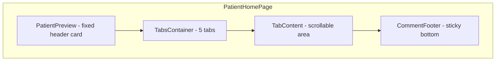

# Patient Home Page Implementation

## Current State

`[PatientHomePage.tsx](src/features/patient/PatientHomePage.tsx)` is a minimal placeholder showing just the patient name. The `Patient` type in `[types.ts](src/features/patient/types.ts)` only has: `id`, `name`, `gender`, `dob`, `nhsNumber`, `lastAppointment`.

## Layout Overview

The Patient Home content area (right of the DailyScheduleSidebar, below the SearchBar) will follow this vertical structure:

## Step 1: Extend Patient Data Model

**File:** `[src/features/patient/types.ts](src/features/patient/types.ts)`

Add optional fields to the `Patient` interface:

- `address?: string` (e.g. "68 Kendell Street Sheffield S1 9BN")
- `allergies?: string[]` (e.g. `["Seafood"]`)
- `incomingAppointment?: string` (e.g. "11:30 am, 12 Feb")

**File:** `[src/features/patient/patientData.ts](src/features/patient/patientData.ts)`

Add the new fields to a subset of existing mock entries (at least the ones used in `FAKE_APPOINTMENTS`). Not every patient needs all fields populated.

## Step 2: Create PatientPreview Component

**New file:** `src/features/patient/PatientPreview.tsx`

A card component that receives a `Patient` object and renders:

- **Row 1:** Patient name (H3, semibold) + green incoming appointment badge (right-aligned, conditionally shown)
- **Row 2:** Info line: `Gender | NHS Number | DOB (age) | Address` separated by pipe characters
- **Row 3:** Allergies line with red error icon + "Known allergies:" text + bold allergy names (conditionally shown if allergies exist)

Styling: `bg-caars-neutral-grey-3` card with border, rounded-2xl, padding px-5 py-4, gap-3.

Reuse `IconInfo` from `[src/lib/icon.ts](src/lib/icon.ts)` for the allergy warning icon (styled red).

## Step 3: Create ClinicalPreviewTab Component

**New file:** `src/features/patient/ClinicalPreviewTab.tsx`

Contains the 4 sections in a scrollable column:

### Section 1: Pre-generated Summary

Three collapsible subsections, each with a title + chevron toggle:

- **Medical History** -- lorem ipsum placeholder text
- **Relevant Clinical Events** -- lorem ipsum placeholder text  
- **Allergies** -- lorem ipsum placeholder text

Each subsection uses local `useState` for expand/collapse. Use `IconChevronUp` / `IconChevronDown` from the icon lib. Default state: expanded.

### Section 2: Triage Input

An orange-tinted container (`bg-caars-primary-2`) with rounded corners, containing:

- A row with a text input field (use `[CInput](src/components/caars-ui/CInput.tsx)` or a simple styled input) + a "Find Relevance" solid `[CButton](src/components/caars-ui/CButton.tsx)`
- A helper text line below: "It will take a minute or two..."

### Section 3: Previous Summaries Placeholder

A simple button/text: "Show previous summaries" with a chevron-down icon. No expand logic yet -- just reserve the space. Use `IconChevronDown` + grey text styling.

### Section 4: (Handled separately as CommentFooter)

## Step 4: Create CommentFooter Component

**New file:** `src/features/patient/CommentFooter.tsx`

A sticky bottom bar with:

- **Left side:** "Last update: dd/mm/yyyy" + "Powered by CAARS AI. Clinician should cross-check for accuracy." (grey subtext)
- **Right side:** Two buttons using `[CButton](src/components/caars-ui/CButton.tsx)`:
  - "Comment History" -- variant `outline-black`, with a comment icon prefix
  - "Write a Comment" -- variant `outline-color`, with an edit icon prefix

Use existing icons from `[icon.ts](src/lib/icon.ts)`: `IconCommentDots` for Comment History, `IconEdit` for Write a Comment.

## Step 5: Rewrite PatientHomePage

**File:** `[src/features/patient/PatientHomePage.tsx](src/features/patient/PatientHomePage.tsx)`

The page will be a `flex flex-col flex-1 min-h-0 overflow-hidden` container with:

1. **PatientPreview** (fixed, shrink-0) -- wrapped in a grey background container
2. **Tabs** from `[src/components/ui/tabs.tsx](src/components/ui/tabs.tsx)` using the `line` variant:
  - `TabsList` with 5 `TabsTrigger`s: Clinical preview, Timeline, Patient Info, Previous Encounters, Patient Documents
  - Style the active tab trigger with `text-caars-primary-1` and an orange bottom underline
  - `TabsContent` for each tab -- only Clinical Preview has content, others show placeholders
3. The Clinical Preview `TabsContent` contains a flex column that is scrollable, housing `ClinicalPreviewTab`
4. **CommentFooter** (fixed at bottom, shrink-0) -- sits outside the scrollable area

Default active tab: `clinical-preview`.

### Tab styling override

The shadcn Tabs `line` variant has a black underline by default. Override the active tab trigger to use `text-caars-primary-1` color and `after:bg-caars-primary-1` for the underline, matching the Figma design (orange active tab, grey inactive tabs).

## Step 6: Add Missing Icons

**File:** `[src/lib/icon.ts](src/lib/icon.ts)`

Add `AlertCircle` (or reuse `IconInfo`) for the allergies warning. Check if `MessageCircleMore` (already exported as `IconCommentDots`) and `PencilLine` (already exported as `IconEdit`) cover the footer buttons -- they do.

## File Summary

| Action          | File                                          |
| --------------- | --------------------------------------------- |
| Modify          | `src/features/patient/types.ts`               |
| Modify          | `src/features/patient/patientData.ts`         |
| Create          | `src/features/patient/PatientPreview.tsx`     |
| Create          | `src/features/patient/ClinicalPreviewTab.tsx` |
| Create          | `src/features/patient/CommentFooter.tsx`      |
| Rewrite         | `src/features/patient/PatientHomePage.tsx`    |
| Possibly modify | `src/lib/icon.ts`                             |

