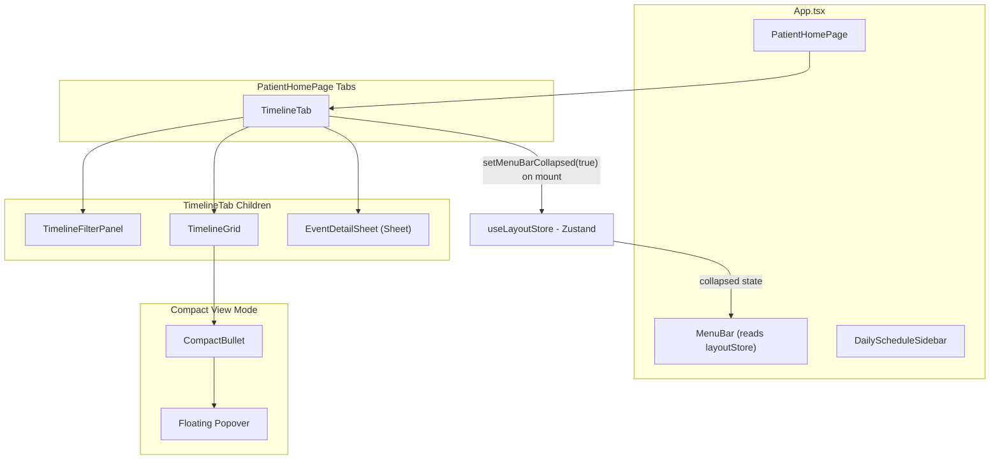

# Patient Timeline Tab Implementation

## Architecture Overview




## File Structure

New/modified files inside `src/features/patient/timeline/`:

- `[types.ts](src/features/patient/timeline/types.ts)` -- Timeline-specific types (TimelineEvent, SeverityLevel, DiagnosisCategory, etc.)
- `[timelineData.ts](src/features/patient/timeline/timelineData.ts)` -- Comprehensive mock data with events across multiple months, categories, and severity levels
- `[TimelineTab.tsx](src/features/patient/timeline/TimelineTab.tsx)` -- Main container; orchestrates all state (filters, view mode, selected event)
- `[TimelineFilterPanel.tsx](src/features/patient/timeline/TimelineFilterPanel.tsx)` -- Left sidebar with filters
- `[TimelineGrid.tsx](src/features/patient/timeline/TimelineGrid.tsx)` -- Right-side scrollable grid with sticky headers
- `[TimelineEventCard.tsx](src/features/patient/timeline/TimelineEventCard.tsx)` -- Individual event card (colored by severity)
- `[EventDetailSheet.tsx](src/features/patient/timeline/EventDetailSheet.tsx)` -- Right-side Sheet panel for event details
- `[CompactBullet.tsx](src/features/patient/timeline/CompactBullet.tsx)` -- Colored dot for compact view with popover on click
- `[index.ts](src/features/patient/timeline/index.ts)` -- Re-export (already exists)

Other files:

- `[src/stores/layoutStore.ts](src/stores/layoutStore.ts)` -- New Zustand store for cross-component layout state
- `[src/layouts/MenuBar.tsx](src/layouts/MenuBar.tsx)` -- Modify to read collapse state from layoutStore
- `[src/index.css](src/index.css)` -- Add missing `--caars-text-body-3` / `--font-size-caars-body-3` / `--font-size-caars-h5` tokens if needed

---

## 1. Data Model (`types.ts`)

```typescript
type SeverityLevel = 'emergency' | 'routine' | 'normal';

interface DiagnosisCategory {
  id: string;
  label: string; // e.g. "General Practice", "Pathology"
}

interface TimelineEvent {
  id: string;
  title: string;
  date: string; // ISO date
  severity: SeverityLevel;
  categoryId: string;
  relatedConditions?: string[];
  clinicalDocument?: string;
}

interface TimelineFilters {
  severityLevels: SeverityLevel[];
  categoryIds: string[];
  dateRange: { from: Date | undefined; to: Date | undefined };
}
```

Severity-to-color mapping reuses existing CAARS tokens:

- **Emergency**: `bg-caars-error-2` / `text-caars-error-1`
- **Routine**: `bg-caars-warning-2` / `text-caars-warning-1`
- **Normal**: `bg-caars-success-2` / `text-caars-success-1`

---

## 2. Layout Store (`src/stores/layoutStore.ts`)

A small Zustand store to control the MenuBar collapsed state from anywhere:

```typescript
interface LayoutState {
  menuBarCollapsed: boolean;
  setMenuBarCollapsed: (collapsed: boolean) => void;
}
```

---

## 3. MenuBar Integration (`src/layouts/MenuBar.tsx`)

- Replace `useState(false)` with `useLayoutStore` for `collapsed`.
- The `onCollapsedChange` callback in `MenuTabs` will call `setMenuBarCollapsed()` so user can still manually toggle.
- No changes to the DailyScheduleSidebar (it already defaults to open).

---

## 4. TimelineTab (Main Container)

State managed here:

- `isCompactView: boolean` -- toggles between normal and compact view
- `filters: TimelineFilters` -- severity, categories, date range
- `selectedEvent: TimelineEvent | null` -- triggers Sheet open

On mount: calls `setMenuBarCollapsed(true)` via layoutStore. On unmount: optionally restores it to false (or leaves as-is since other tabs don't need it collapsed).

Layout: `flex` row with `TimelineFilterPanel` (fixed ~280px width, vertically scrollable) on the left and `TimelineGrid` (flex-1, both-axis scrollable) on the right.

---

## 5. TimelineFilterPanel (Left Side)

From top to bottom:

- **Compact/Normal View button** -- orange button with icon, toggles `isCompactView`
- **Staff Severity Level** -- section header + 3 checkbox rows (Emergency/Routine/Normal) with colored dot indicators and event counts
- **Diagnosis Categories** -- section header + dynamic checkbox list of categories with event counts
- **Date Range** -- "From" and "To" date inputs (using existing `Calendar` component or plain inputs with calendar icon), a reset icon button, an "Apply" button
- **Quick select buttons** -- "Last 6 months", "Last year", "Last 2 years" as small pill buttons

Uses existing shadcn `Checkbox` component from `[src/components/ui/checkbox.tsx](src/components/ui/checkbox.tsx)`.

---

## 6. TimelineGrid (Right Side)

This is the most complex component. Structure:

```
+----------+-------------+-------------+-------------+-----+
| (sticky) | Category 1  | Category 2  | Category 3  | ... |  <-- sticky top header
+----------+-------------+-------------+-------------+-----+
| May 2025 |  [card]     |             |             |     |  <-- month row
| [4 Evts] |  [card]     |             |             |     |
+----------+-------------+-------------+-------------+-----+
| Jul 2025 |             |  [card]     |             |     |
| [1 Evt]  |             |             |             |     |
+----------+-------------+-------------+-------------+-----+
```

Key behaviors:

- **Dynamic Y-axis**: Only months with events are shown. Group events by month-year, sort chronologically.
- **Sticky column headers**: Category names stick to the top during vertical scroll.
- **Sticky month labels**: Month labels on the left stick during horizontal scroll.
- **Scrollable**: The grid container has `overflow: auto` for both axes.
- Each column has a vertical separator line (matching the Figma).
- Month row header shows month/year label + event count badge (e.g. "4 Events" in green pill).

Implementation approach: CSS Grid or a `<table>`-like flex layout with `position: sticky` for headers and left labels, similar to the existing FullCalendar CSS pattern in `index.css`. A CSS Grid approach is recommended:

- Column 0: sticky month labels (~120px)
- Columns 1..N: one per diagnosis category (~200px each)
- Row 0: sticky header row

---

## 7. TimelineEventCard

Adapts the existing `[src/components/TimelineItem.tsx](src/components/TimelineItem.tsx)` pattern but sized for the timeline grid (~190px wide per the Figma):

- Background color by severity
- Title (truncated with ellipsis)
- Date subtitle
- Small colored dot on the left edge
- `cursor-pointer`, calls `onSelect(event)` to open the Sheet

---

## 8. CompactBullet (Compact View)

When `isCompactView` is true, event cards are replaced with small colored circles (~8px):

- Color matches severity (error-1, warning-1, success-1)
- On click, a floating **Popover** appears near the bullet showing the full `TimelineEventCard`
- Can use Radix `Popover` or a simple absolutely-positioned div with click-outside-to-close

---

## 9. EventDetailSheet

Uses the existing `[Sheet](src/components/ui/sheet.tsx)` component (side="right"). Content structure from Figma:

- **Header** (colored background matching severity): severity badge pill, close button, event title, date + document icon
- **Related Conditions**: badges/pills listing related conditions
- **Clinical Safety Warning**: yellow warning box with safety disclaimer
- **Full Clinical Document**: grey background block with formatted clinical text

---

## 10. Mock Data (`timelineData.ts`)

Comprehensive dataset for patient ID "1" (Betty Wong):

- 5-6 diagnosis categories (General Practice, Pathology, Respiratory, Emergency, Cardiovascular, etc.)
- 10-15 events spread across multiple months (May 2025 through Jan 2026)
- Mix of all three severity levels
- Full clinical document text for at least 2-3 events
- Related conditions arrays

---

## Potential Considerations

- **Missing CSS tokens**: The codebase uses `text-caars-body-3` and `text-caars-h5` in existing components but these aren't defined in the `@theme` block in `index.css`. We should add `--font-size-caars-body-3`, `--font-size-caars-h5`, and their line-height counterparts to prevent silent styling failures.
- **Popover component**: Not currently installed via shadcn. We can either install it (`pnpm dlx shadcn@latest add popover`) or build a lightweight popover with absolute positioning + click-outside detection. Installing shadcn popover is the cleaner approach.
- **Date picker for filter**: The existing `Calendar` component can be wrapped in a Popover for the date range inputs, or we can use simple `<input type="date">` for now and enhance later.

