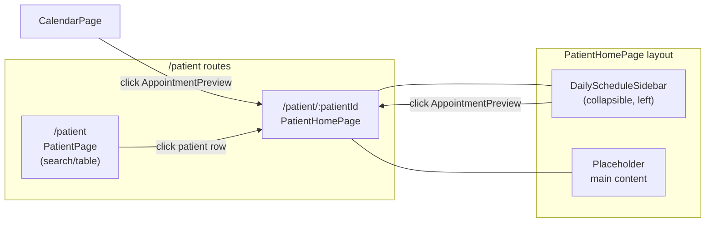

# Vertical Calendar Sidebar & Patient Home

## Architecture




## Files to Change

### 1. Add `patientId` to appointment data

**[src/features/calendar/calendarData.ts](src/features/calendar/calendarData.ts)**

- Add `patientId: string` to `CalendarAppointment.extendedProps`
- Update all `FAKE_APPOINTMENTS` entries to include `patientId` values that map to existing patient IDs in [src/features/patient/patientData.ts](src/features/patient/patientData.ts)
- Update `FAKE_SEARCH_RESULTS` with matching `patientId` if needed

### 2. Add `onClick` prop to AppointmentPreview

**[src/components/AppointmentPreview.tsx](src/components/AppointmentPreview.tsx)**

- Add optional `onClick?: () => void` prop
- Attach `onClick` to the active-state `<button>` element
- The parent component is responsible for calling `navigate()`

### 3. Create DailyScheduleSidebar

**New: `src/features/patient/DailyScheduleSidebar.tsx`**

A standalone collapsible sidebar component:

- **Collapsed state**: 32px wide, shows only the "Daily Schedule" icon + expand arrow (mirroring MenuBar's pattern from [src/layouts/menuBar/MenuTabs.tsx](src/layouts/menuBar/MenuTabs.tsx))
- **Expanded state**: 280px wide
- **Header**: "Daily Schedule" title (orange, `text-caars-primary-1`) with task icon + collapse/expand toggle button
- **Doctor dropdown**: Uses `Select`/`SelectTrigger`/`SelectContent`/`SelectItem` from [src/components/ui/select.tsx](src/components/ui/select.tsx). Custom trigger showing doctor name + "N appointments remaining" subtitle with chevron. Doctor list sourced from the staff list passed as props
- **Date navigator**: Left/right chevron arrows + centered date label (e.g. "12 February 2026"), pattern borrowed from the day-mode section of [src/features/calendar/CalendarHeader.tsx](src/features/calendar/CalendarHeader.tsx) but in a compact `bg-caars-neutral-grey-3` pill style matching the Figma
- **Timeslot grid**: Scrollable `overflow-y-auto` container. Time range 9:00 AM - 6:00 PM in 10-min increments. Each timeslot row has:
  - A time label divider: `--- 11:30 am ---` (grey line + centered text, matching the Figma `SidebarSection` pattern)
  - An optional `AppointmentPreview` card if an appointment exists at that time
  - An empty spacer (h-[73px]) if no appointment
- Filter appointments by selected doctor + selected date using existing `getAppointmentsForDate` and `getAppointmentsForDoctor` from [src/features/calendar/calendarData.ts](src/features/calendar/calendarData.ts)
- Clicking an `AppointmentPreview` navigates to `/patient/:patientId`
- The currently-viewed patient's appointment (matching route param `patientId`) gets a green border (`border-2 border-caars-success-1`) per the Figma

### 4. Create PatientHomePage

**New: `src/features/patient/PatientHomePage.tsx`**

- Reads `patientId` from `useParams()`
- Layout: `flex` row with `DailyScheduleSidebar` on the left + main content area on the right
- Main content area: placeholder text "Patient Home" centered
- Passes staff list, selected date, and navigation callbacks to the sidebar

### 5. Update routing in App.tsx

**[src/App.tsx](src/App.tsx)**

Current:

```tsx
<Route path={NAV_PATHS.patient} element={<PatientPage />} />
```

Change to nested routes:

```tsx
<Route path="/patient" element={<PatientPage />} />
<Route path="/patient/:patientId" element={<PatientHomePage />} />
```

The `getActiveNavItem` function already handles `pathname.startsWith('/patient')`, so the "patient" nav item in the MenuBar will stay highlighted for both routes.

### 6. Wire up navigation from patient table rows

**[src/features/patient/PatientPage.tsx](src/features/patient/PatientPage.tsx)**

- Import `useNavigate` from react-router
- Change `handleRowClick` to: `navigate(\`/patient/${patient.id})`

### 7. Wire up navigation from CalendarDayView appointments

**[src/features/calendar/CalendarDayView.tsx](src/features/calendar/CalendarDayView.tsx)**

- In `renderEventContent`, pass an `onClick` prop to `AppointmentPreview` that calls `navigate(\`/patient/${patientId})`using the appointment's`extendedProps.patientId`
- This requires either lifting `navigate` into the render function or using `useNavigate` at the component level and threading it through

## Potential Blockers / Considerations

- **No `ClipboardCheck` or task icon in the icon library**: The Figma shows a task/clipboard icon for "Daily Schedule". Lucide has `ClipboardCheck` which is close -- we need to add it to [src/lib/icon.ts](src/lib/icon.ts) as `IconTask` or similar
- **Staff list prop threading**: `PatientHomePage` needs access to the staff list and the current user ID. These currently live in `App.tsx` state. We can either pass them via route state, lift them into Zustand, or pass as props from App.tsx through the route. Passing through route element props is simplest for now
- **Mock data only**: All appointment filtering uses the in-memory `FAKE_APPOINTMENTS`. No API integration needed at this stage
- **FullCalendar not needed**: The vertical calendar sidebar is a custom React component (simple timeslot list), not a FullCalendar instance. This keeps it lightweight

